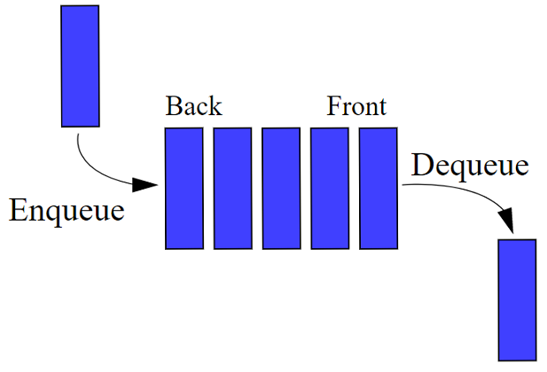
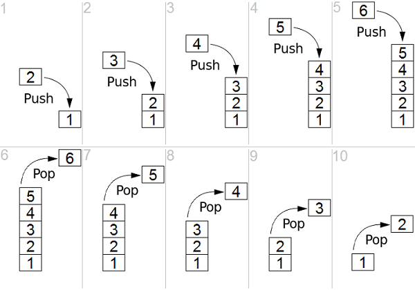
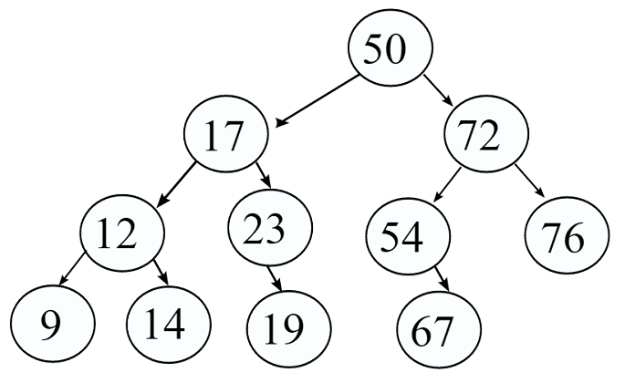
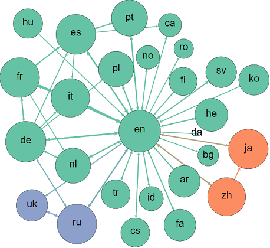

# Data Structures and Algorithms
> This repo contains my implementations of several data structures and algorithms in C. You are free
> to use these programs wherever you want without permission. This comes without any warranties
> though!

-------------------------------------------------------

## Table of Contents
* [1.0. Data Structures](#10-data-structures)
  * [1.1. Linear Data Structures](#11-linear-data-structures)
    * [1.1.1. Linked List](#111-linked-list)
      * [1.1.1.1 Single Linked List](#1111-single-linked-list)
      * [1.1.1.2 Double Linked List](#1112-double-linked-list)
    * [1.1.1. Queues](#112-queues)
    * [1.1.1. Stacks](#113-stacks)
  * [1.2. Non-Linear Data Structures](#12-non-linear-data-structures)
    * [1.2.1 Trees](#121-trees)
    * [1.2.2 Graphs](#122-graphs)
* [2.0. Algorithms](#20-algorithms)
  * [2.1. Sorting Algorithms](#21-sorting-algorithms)
    * [2.1.1. Bubble Sort](#211-bubble-sort)
    * [2.1.2. Heap Sort](#212-heap-sort)
    * [2.1.3. Insertion Sort](#213-insertion-sort)
    * [2.1.4. Merge Sort](#214-merge-sort)
    * [2.1.5. Quick Sort](#215-quick-sort)
    * [2.1.6. Radix Sort](#216-radix-sort)
    * [2.1.7. Selection Sort](#217-selection-sort)
  * [2.2. Searching Algorithms](#21-searching-algorithms)

-------------------------------------------------------

# 1.0. Data Structures
Data strcutures are a way of handling complex data in a language. They are built upon the language's
native datatypes to provide ways to handle data that the language doesn't provide by default.

Data structures can be briefly classified into two types based on how they are allocated in the
system memory.

Data structures can be implemented either by using built-in arrays or a using a group of nodes.

```
// Arrays
┌───┬───┬───┬───┬───┐
│ A │ B │ C │ D │ E │
└───┴───┴───┴───┴───┘
  0   1   2   3   4

// Nodes
┌─────┬───┐    ┌─────┬───┐    ┌─────┬───┐
│  A  │ ╾─┼────┾  B  │ ╾─┼────┾  C  │ ╳ │
└─────┴───┘    └─────┴───┘    └─────┴───┘
   1483            2146           4738
```

## 1.1. Linear Data Structures
Linear data structures can be represented as they are linear in nature.

### 1.1.1 Linked List
Linked lists are data structures made of nodes that point to each other to form a list.

Linked lists have a `HEAD` pointer that points to the first node in the list. They also have an optional `TAIL` pointer that pointes to the last node in the list.

> **Note:** Circular linked lists are variants of linked lists where
> 1. The last node points to the first node in the single linked list
> 2. Along with 1, the first node points to last node in double linked list

#### 1.1.1.1 Single Linked List
Single linked list are a group of nodes where each node has only a single pointer that points to the
next node in the list.

[`<code>`](data-structures/linear/linked-lists/singly_linked_list.c)

```
// A single linked list
┌─────┬───┐    ┌─────┬───┐    ┌─────┬───┐
│  A  │ ╾─┼────┾  B  │ ╾─┼────┾  C  │ ╳ │
└─────┴───┘    └─────┴───┘    └─────┴───┘
   1483            2146           4738
```

**Use for**
* Minimum space
* Travel only one direction
* Insertions at head

**Don't use for**
* Tail insertions only
* Searching

| Operation    | Time Complexity |
|--------------|-----------------|
| Insert Head  |          `O(1)` |
| Insert Index |          `O(n)` |
| Insert Tail  |          `O(n)` |
| Remove Head  |          `O(1)` |
| Remove Index |          `O(n)` |
| Remove Tail  |          `O(n)` |
| Find Object  |          `O(n)` |

> **Note:** Insertions at tail can be made `O(1)` by just having a TAIL pointer in any linked list.

#### 1.1.1.2 Double Linked List
Double linked lists are similar to single linked lists but each node has two pointers that point to
the next and previous elements in the list. This helps in traversal of list in either directions.

[`<code>`](data-structures/linear/linked-lists/doubly_linked_list.c)

```
// Doubly linked list
            ┌────────┐         ┌────────┐
┌───┬─────┬─┴─┐    ┌─┴─┬─────┬─┴─┐    ┌─┴─┬─────┬───┐
│ ╳ │  A  │   │    │   │  B  │   │    │   │  C  │ ╳ │
└───┴─────┴─┬─┘    └─┬─┴─────┴─┬─┘    └─┬─┴─────┴───┘
            └────────┘         └────────┘
     1483                2146               4738
```

Double linked lists use more space compared to single linked list as they also need to allocate
memory for additional pointers.

**Use for**
* Bi-directional traversal

**Don't use for**
* Having minimum space

| Operation    | Time Complexity |
|--------------|-----------------|
| Insert Head  |          `O(1)` |
| Insert Index |          `O(n)` |
| Insert Tail  |          `O(n)` |
| Remove Head  |          `O(1)` |
| Remove Index |          `O(n)` |
| Remove Tail  |          `O(n)` |
| Find Object  |          `O(n)` |

### 1.1.2. Queues
Queues are data structures that allow insertion of elments at one end and removal of elements at the
other. This is also called the `FIFO` (**F**irst **I**n **F**irst **O**ut) ordering of elements.



#### Implementations
* [Queue using Arrays](data-structures/linear/queues/queue_array.c)
* [Circular Queue using Arrays](data-structures/linear/queues/circular_queue_array.c)
* [Queues using Circular Linked List](data-structures/linear/queues/queue_circular_linked_list.c)

### 1.1.3. Stacks
Stacks are data structures that allows insertion and removal at the same end. This is also called
`LIFO` (**L**ast **I**n **F**irst **O**out) ordering of elements.



#### Implementations
* [Stack using Arrays](data-structures/linear/stacks/stack_array.c)
* [Stack using Linked List](data-structures/linear/stacks/stack_linked_list.c)

## 1.2. Non-Linear Data Structures
Non-linear data structures don't have a linear structure in the sense that they cannot be represented using linear ordering of elements.


### 1.2.1 Trees
Trees can be visually represented as an upside down tree. There is a root node that has many children nodes. These nodes in-turn have their own child nodes based on the following rules.

#### Rules
* Nodes don't have a common child
* Nodes can have common parent



#### Implementaions
* [Binary Search Tree](data-structures/non-linear/trees/binary_search_tree.c)


### Graphs
Graphs are trees where any node can be connected to any other node. This causes loops, which is common in graphs.



#### Implementations
* [Breadth First Search](data-structures/non-linear/graphs/breadth_first_search.c)
* [Depth First Search](data-structures/non-linear/graphs/depth_first_search.c)


# 2.0. Algorithms

## 2.1. Sorting Algorithms

### 2.1.1. Bubble Sort


_Stable:_ `true`

_Worst-case space complexity:_ `O(1)`

_Time complexity:_

| Operation    | Time Complexity |
|--------------|-----------------|
| Best         |          `O(n)` |
| Average      |        `O(n^2)` |
| Worst        |        `O(n^2)` |

### 2.1.2. Heap Sort


_Stable:_ `false`

_Worst-case space complexity:_ `O(1)`

_Time complexity:_

| Operation    | Time Complexity |
|--------------|-----------------|
| Best         |          `O(n)` |
| Average      |   `O(n log(n))` |
| Worst        |   `O(n log(n))` |

### 2.1.3. Insertion Sort


_Stable:_ `true`

_Worst-case space complexity:_ `O(n)`

_Time complexity:_

| Operation    | Time Complexity |
|--------------|-----------------|
| Best         |          `O(n)` |
| Average      |        `O(n^2)` |
| Worst        |        `O(n^2)` |

### 2.1.4. Merge Sort


_Stable:_ `true`

_Worst-case space complexity:_ `O(n)`

_Time complexity:_

| Operation    | Time Complexity |
|--------------|-----------------|
| Best         |   `O(n log(n))` |
| Average      |   `O(n log(n))` |
| Worst        |   `O(n log(n))` |

### 2.1.5. Quick Sort


_Stable_: `true`

_Worst-case space complexity:_ `O(n)`

_Time complexity:_

| Operation    | Time Complexity |
|--------------|-----------------|
| Best         |   `O(n log(n))` |
| Average      |   `O(n log(n))` |
| Worst        |        `O(n^2)` |

### 2.1.6. Radix Sort
[Radix sort visualization (external)](https://visualgo.net/en/sorting)

_Stable_: `true`

_Worst-case space complexity:_ `O(n+k)`

_Time complexity:_

| Operation    | Time Complexity |
|--------------|-----------------|
| Best         |         `O(nk)` |
| Average      |         `O(nk)` |
| Worst        |         `O(nk)` |

> **Note:** Here `k` is the base (usually 10) of the type of number system that is being sorted

-------------------------------------------------------

# License
Except as otherwise noted, the content of this page is licensed under the [Creative Commons Attribution 3.0 License](http://creativecommons.org/licenses/by/3.0/), and code files and samples are licensed under the [MIT](LICENSE) License.
